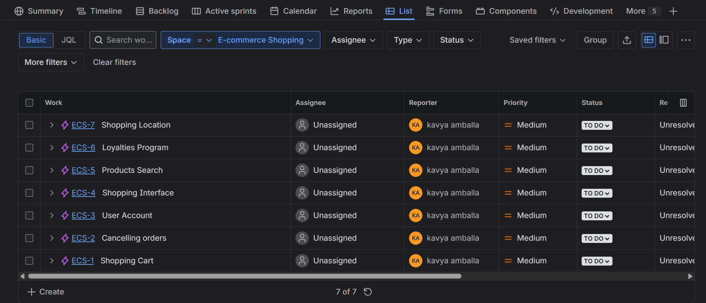
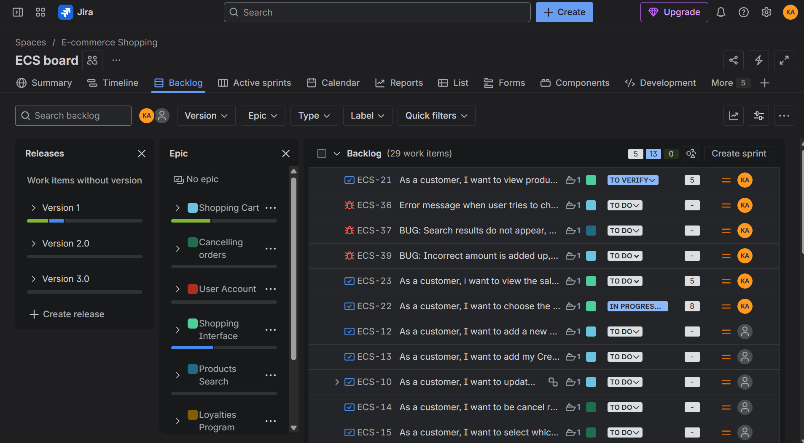
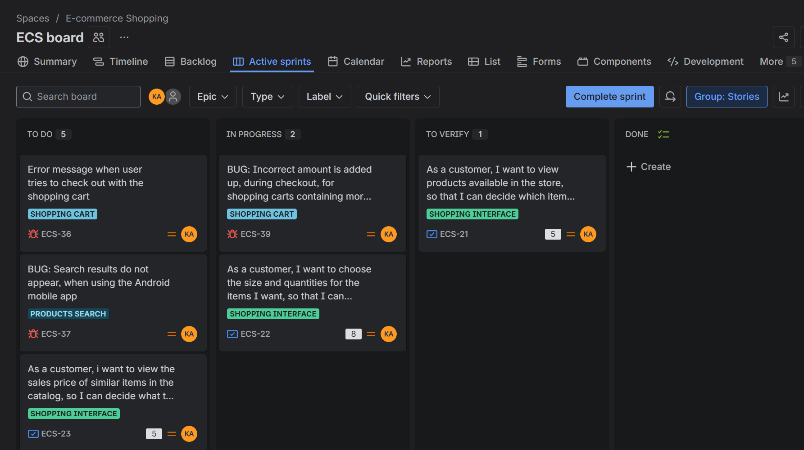
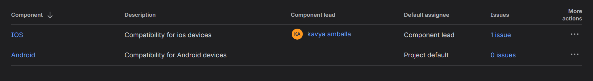
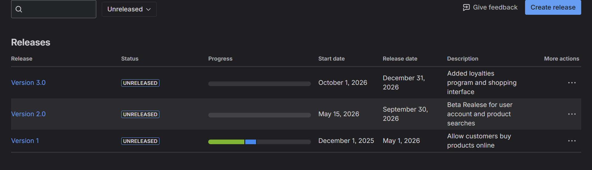

# 🛒 E-Commerce Shopping (ECS) – Jira Scrum Project Management

## 📌 Overview
This repository showcases the **project management and Agile Scrum execution** of the **E-Commerce Shopping (ECS)** project using **Jira Software**.

The project was planned, tracked, and managed end-to-end following **Agile Scrum practices**.  
Due to **Jira free-plan access restrictions**, live board access is limited, so **screenshots are provided as evidence**.

---

## 🧰 Tools & Methodology
- Jira Software (Scrum Board)
- Agile Scrum Framework
- Epics, User Stories, Tasks, Bugs
- Sprint-based planning
- Release & version management

---

## 🧩 Project Structure (Epics)
The ECS project was divided into the following functional epics:
- Shopping Cart  
- Products Search  
- Shopping Interface  
- User Account  
- Cancelling Orders  
- Loyalties Program  
- Shopping Location  

Each epic was broken down into detailed user stories and bugs.

---

## 📋 Product Backlog Management
- Maintained a prioritized backlog of 29+ work items
- Used user-story format: *As a customer, I want to…*
- Tracked functional tasks and bugs separately
- Used Jira statuses to track progress

---

## 🔄 Sprint & Workflow Tracking
The Scrum workflow followed:
- To Do  
- In Progress  
- To Verify  
- Done  

Tasks were tracked continuously to monitor sprint progress and delivery.

---

## 🧱 Component Management
Components were created to represent platform-specific concerns:
- iOS compatibility  
- Android compatibility  

Each component had defined ownership to ensure accountability.

---

## 🚀 Release & Version Planning
Multiple releases were planned and tracked:

| Version | Description |
|-------|------------|
| Version 1 | Core shopping & purchase flow |
| Version 2.0 | User account & product search (Beta) |
| Version 3.0 | Loyalties program & UI enhancements |

---

## 🔒 Jira Board Access
🔒 Jira board access is restricted due to free-plan permissions.  
Screenshots are provided to demonstrate real Agile execution and project management practices.

🔗 Jira Board (Login required):  
https://amballakavya.atlassian.net/jira/software/c/projects/ECS/boards/3

---

## 🎯 Project Management Skills Demonstrated
- Agile Scrum execution  
- Requirement analysis & story writing  
- Backlog prioritization  
- Sprint & workflow tracking  
- Release planning  
- Stakeholder-oriented delivery

